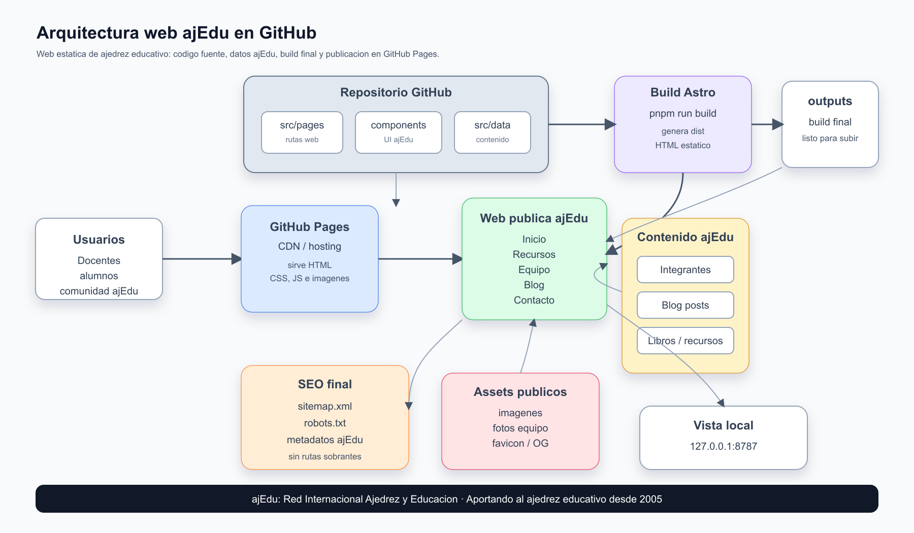

<div align="center">

# ajEdu

**Red Internacional Ajedrez y Educacion**

Aportando al ajedrez educativo desde 2005.


Sitio web estatico para compartir recursos, experiencias, proyectos, publicaciones e integrantes de la comunidad ajEdu.

</div>

---

## Que es ajEdu

ajEdu es una red internacional de docentes, educadores, investigadores, monitores, clubes y proyectos que utilizan el ajedrez como herramienta educativa.

La web recoge contenidos para llevar el ajedrez al aula, compartir experiencias reales, difundir materiales didacticos, presentar libros de integrantes y conectar webs colaboradoras.

## Que contiene la web

- Inicio editorial de ajEdu.
- Recursos de ajedrez educativo.
- Equipo, coordinacion e integrantes.
- Blog con articulos, experiencias, congresos e investigacion.
- Webs colaboradoras y proyectos amigos.
- Pagina de contacto con `info@ajedu.com`.
- SEO final: sitemap, robots.txt y metadatos propios de ajEdu.

## Arquitectura



La web se construye como sitio estatico:

```text
Repositorio GitHub
  -> Astro build
  -> HTML / CSS / JS estatico
  -> GitHub Pages
  -> Web publica ajEdu
```

## Stack tecnico

| Area | Tecnologia |
| --- | --- |
| Framework | Astro |
| Componentes | React |
| Lenguaje | TypeScript |
| Estilos | Tailwind CSS |
| Iconos | Lucide React |
| Animaciones | Motion |
| Publicacion | GitHub Pages / hosting estatico |

## Estructura del proyecto

```text
.
+-- public/
|   +-- images/
|   +-- favicon.svg
|   +-- robots.txt
+-- src/
|   +-- components/
|   |   +-- layout/
|   |   +-- sections/
|   |   +-- ui/
|   +-- config/
|   +-- data/
|   |   +-- ajedu-members.ts
|   |   +-- blog/
|   |   +-- features.ts
|   |   +-- legal.ts
|   |   +-- testimonials.ts
|   +-- layouts/
|   +-- pages/
|   |   +-- index.astro
|   |   +-- about.astro
|   |   +-- features.astro
|   |   +-- contact.astro
|   |   +-- blog/
|   |   +-- privacy.astro
|   |   +-- terms.astro
|   +-- styles/
+-- astro.config.mjs
+-- package.json
+-- README.md
```

## Rutas principales

| Ruta | Contenido |
| --- | --- |
| `/` | Portada de ajEdu |
| `/features/` | Recursos de ajedrez educativo |
| `/about/` | Equipo e integrantes |
| `/blog/` | Articulos y experiencias |
| `/contact/` | Contacto |
| `/privacy/` | Politica de privacidad |
| `/terms/` | Terminos de uso |

## Desarrollo local

Instalar dependencias:

```bash
pnpm install
```

Levantar entorno local:

```bash
pnpm run dev
```

Crear build final:

```bash
pnpm run build
```

Previsualizar build:

```bash
pnpm run preview
```

## Comandos utiles

| Comando | Uso |
| --- | --- |
| `pnpm run dev` | Servidor local de desarrollo |
| `pnpm run build` | Genera la web estatica en `dist/` |
| `pnpm run preview` | Sirve el build de produccion |
| `pnpm run typecheck` | Revisa tipos de Astro y TypeScript |
| `pnpm run lint` | Revisa estilo y calidad del codigo |

## Contenido editable

La mayor parte del contenido de ajEdu vive en archivos de datos:

- `src/data/blog/` para articulos.
- `src/data/ajedu-members.ts` para integrantes.
- `src/data/features.ts` para recursos y bloques de la pagina de recursos.
- `src/data/testimonials.ts` para testimonios.
- `src/config/site.ts` para marca, contacto, navegacion y SEO.

## Despliegue

El sitio esta pensado para publicarse como web estatica.

Flujo recomendado:

```text
main branch
  -> pnpm install
  -> pnpm run build
  -> publicar dist/ en GitHub Pages
```

Tambien puede servirse desde cualquier hosting estatico que soporte HTML, CSS, JS e imagenes.

## SEO

La web incluye:

- Metadatos propios de ajEdu.
- `robots.txt`.
- Sitemap generado.
- URLs canonicas.
- Datos estructurados basicos de organizacion y sitio web.

## Principios

- Ajedrez como herramienta educativa.
- Recursos utiles para centros y docentes.
- Comunidad internacional y colaborativa.
- Web estatica, rapida y facil de mantener.
- Sin publicidad ni distracciones innecesarias.

## Creditos

Proyecto web de ajEdu, Red Internacional Ajedrez y Educacion.

Coordinacion: Joaquin Fernandez Amigo.

---

<div align="center">

**ajEdu · Red Internacional Ajedrez y Educacion**

</div>
